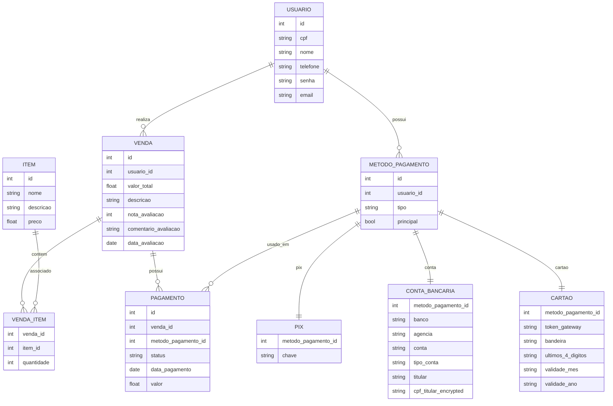

# 🛍️ Sistema de Vendas --- Fullstack

## 📘 Visão Geral da Aplicação

Este projeto implementa um **sistema completo de vendas**, composto por:

* Cadastro de **usuários**
* Cadastro de **itens**
* Registro de **vendas**
* Métodos de pagamento (Pix, Cartão, Conta)
* Pagamentos vinculados à venda
* *Avaliação* como atributo interno da venda (nota e comentário)

A aplicação é composta por:

* **Backend**

  * Node.js + Express
  * TypeScript
  * Sequelize
  * PostgreSQL
  * Swagger (documentação automática)

* **Frontend**

  * React
  * Vite
  * TypeScript

* **Infraestrutura**

  * Docker (para o backend e banco de dados)

---

## 📦 Entidades Principais

### **Usuário**

* id
* cpf
* nome
* telefone
* senha
* email

### **Item**

* id
* nome
* descricao
* preco

### **Venda**

* id
* usuario_id
* valor_total
* descricao
* nota_avaliacao
* comentario_avaliacao
* data_avaliacao

### **Pagamento**

* id
* venda_id
* metodo_pagamento_id
* status
* data_pagamento
* valor

### **Método de Pagamento**

* id
* usuario_id
* tipo
* principal

**Especializações:** Pix, Conta Bancária, Cartão

### **VENDA_ITEM**

* venda_id
* item_id
* quantidade

---

## 📊 Diagrama MER Atualizado



---

# 🚀 Como Rodar a Aplicação

A aplicação possui **frontend e backend separados**, mas pode ser executada de forma unificada.

---

## ✅ 1. Instalar dependências

Antes de rodar o projeto, é necessário instalar as dependências **em ambas as partes**:

### Backend

```bash
cd backend
npm install
```

### Frontend

```bash
cd frontend
npm install
```

---

## ✅ 2. Configurar o `.env` (Backend)

Copie o `.env` disponibilizado e coloque na pasta `backend`:

```
backend
  |-.env
  |-docker-compose.yml
  |-Dockerfile
  |-src/
```

---

## ✅ 3. Subir o backend com Docker

```bash
cd backend
docker compose up --build -d
```

Backend disponível em:

👉 http://localhost:3000
Swagger:

👉 http://localhost:3000/api-docs

---

## ✅ 4. Rodar frontend + backend juntos

Na raiz do projeto:

```
web-2-programming-ufcg/
```

Execute:

```bash
npm run start-all
```

Esse comando irá:

* Iniciar o **frontend**
* Iniciar o **backend**
* Evitar a necessidade de múltiplos terminais

---

## 🔄 Parar containers do backend

```bash
docker compose down
```

---

## ♻️ Reset completo (inclui banco)

```bash
docker compose down -v
docker compose up --build -d
```

---

# 🧪 Como Executar os Testes

Os testes são de integração e rodam **no backend**.

---

## ✅ 1. Instalar dependências

```bash
cd backend
npm install
```

---

## ✅ 2. Rodar todos os testes

```bash
npm run test
```

---

## ✅ 3. Rodar teste específico

```bash
npx jest tests/integration/item.test.ts
```

---

## ✅ 4. Cobertura de código

```bash
npx jest --coverage
```

---

# 👨‍💻 Autores

* Antonio Barros de Alcantara Neto
* Paulo Ricardo Oliveira de Macêdo
